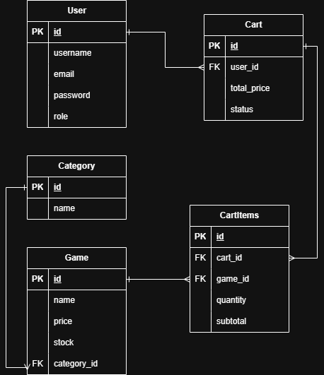

# RetroRespawn API 🎮

A RESTful API for a video game store where users can browse games by category, manage their shopping cart, complete purchases and track their order history. Built with Spring Boot, secured with JWT authentication and role-based access control.

## Architecture
This project follows a **layered architecture** pattern, separating concerns across distinct layers:

- **Controller Layer** — Handles HTTP requests and responses, delegating business logic to the service layer.
- **Service Layer** — Contains all business logic, validations and data transformations using DTOs.
- **Repository Layer** — Manages database access through Spring Data JPA, using derived queries for custom filtering.
- **Security Layer** — Implements stateless authentication using JWT tokens and role-based access control with Spring Security.

This separation of concerns ensures the codebase remains maintainable, scalable and easy to test.

## Database Diagram



## Live Demo
Base URL: `https://gamestore-api-mrqt.onrender.com`

> **Note:** The server may take a few seconds to respond on the first request as it runs on a free tier.

## Tech Stack
- **Java 17**
- **Spring Boot 3.5**
- **Spring Security + JWT**
- **Spring Data JPA + Hibernate**
- **MySQL** (hosted on Railway)
- **Docker** (containerized deployment)
- **Render** (cloud deployment)

## Features
- User registration and login with JWT authentication
- Role-based access control (USER and ADMIN roles)
- Password encryption with BCrypt
- Browse and filter games by category
- Shopping cart management with real-time stock control
- Order history tracking
- Global exception handling

## Project Structure
```
src/main/java/com/sergio/retrorespawn/
├── controller/    # REST controllers
├── service/       # Business logic
├── repository/    # Database access layer
├── model/         # JPA entities
├── dto/           # Data Transfer Objects
├── security/      # JWT configuration
├── filter/        # JWT authentication filter
└── exception/     # Global exception handler
```

## Authentication
This API uses JWT Bearer tokens. To access protected endpoints, include the token in the request header:
Authorization: Bearer <your_token>

### Public Endpoints
| Method | Endpoint | Description |
|--------|----------|-------------|
| POST | `/api/auth/register` | Register a new user |
| POST | `/api/auth/login` | Login and get JWT token |
| GET | `/api/games` | Get all games |
| GET | `/api/games/{id}` | Get game by ID |
| GET | `/api/categories` | Get all categories |
| GET | `/api/categories/{id}` | Get category by ID |

### User Endpoints (Authentication required)
| Method | Endpoint | Description |
|--------|----------|-------------|
| GET | `/api/carts/{userId}/my-cart` | Get active cart |
| PUT | `/api/carts/{userId}/checkout` | Complete purchase |
| GET | `/api/carts/{userId}/history` | Get order history |
| POST | `/api/cart-items/{userId}` | Add game to cart |
| PUT | `/api/cart-items/{id}` | Update item quantity |
| DELETE | `/api/cart-items/{id}` | Remove item from cart |

### Admin Endpoints (ADMIN role required)
| Method | Endpoint | Description |
|--------|----------|-------------|
| GET | `/api/users` | Get all users |
| GET | `/api/users/{id}` | Get user by ID |
| PUT | `/api/users/{id}` | Update user |
| DELETE | `/api/users/{id}` | Delete user |
| POST | `/api/games` | Create game |
| PUT | `/api/games/{id}` | Update game |
| DELETE | `/api/games/{id}` | Delete game |
| POST | `/api/categories` | Create category |
| PUT | `/api/categories/{id}` | Update category |
| DELETE | `/api/categories/{id}` | Delete category |

## Request Examples

### Register
```json
POST /api/auth/register
{
    "username": "johndoe",
    "email": "johndoe@example.com",
    "password": "password123"
}
```

### Login
```json
POST /api/auth/login
{
    "email": "johndoe@example.com",
    "password": "password123"
}
```

### Add game to cart
```json
POST /api/cart-items/{userId}
{
    "gameId": 1,
    "quantity": 2
}
```

### Create game (ADMIN only)
```json
POST /api/games
{
    "name": "The Legend of Zelda",
    "description": "An open world adventure game",
    "price": 59.99,
    "imageUrl": "https://example.com/zelda.jpg",
    "stock": 10,
    "categoryId": 1
}
```

## Local Setup

### Prerequisites
- Java 17
- Maven
- MySQL

### Steps
1. Clone the repository
```bash
git clone https://github.com/SergioRdzMndz/gamestore-api.git
cd gamestore-api
```

2. Create your `application.properties` file based on `application.properties.example`
```properties
spring.datasource.url=jdbc:mysql://localhost:3306/your_database
spring.datasource.username=your_username
spring.datasource.password=your_password
spring.datasource.driver-class-name=com.mysql.cj.jdbc.Driver
spring.jpa.hibernate.ddl-auto=none
jwt.secret=your_secret_key
jwt.expiration=86400000
```

3. Run the application
```bash
mvnw spring-boot:run
```

## Author
**Sergio Rodríguez Mendoza**
- GitHub: [@SergioRdzMndz](https://github.com/SergioRdzMndz)